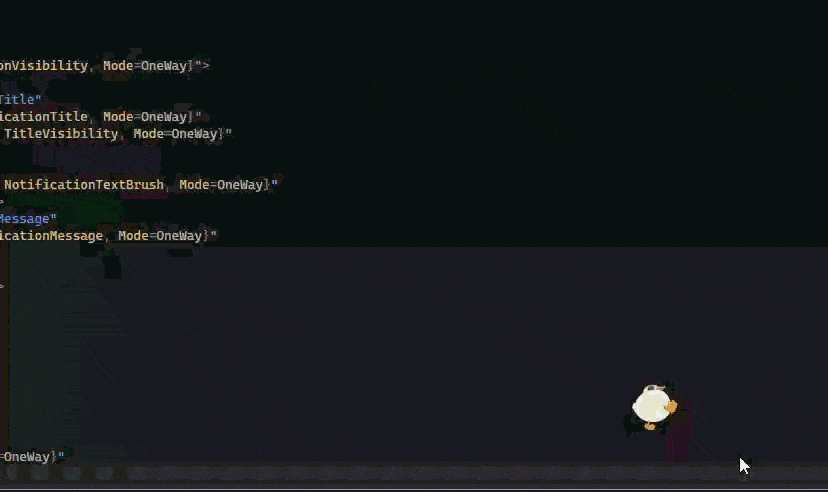
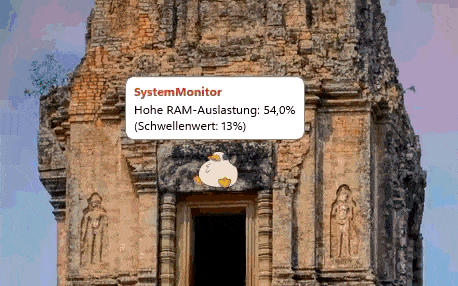
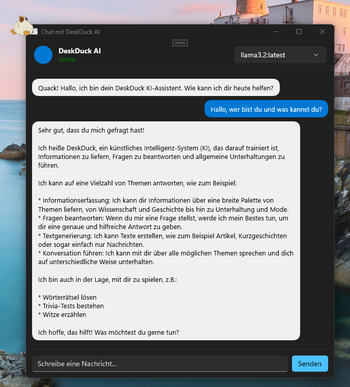
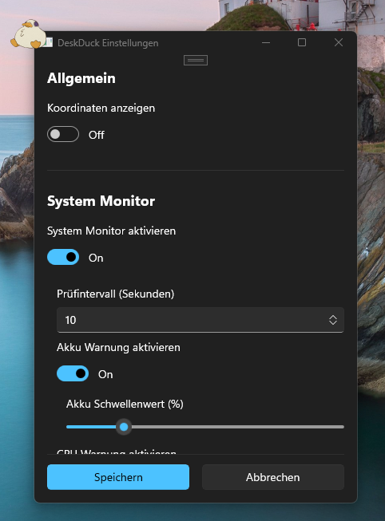
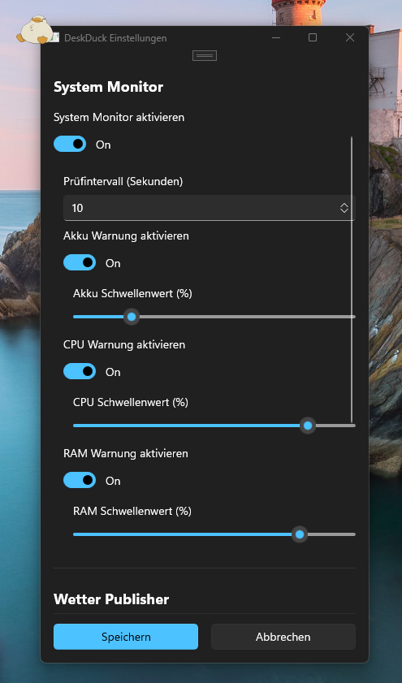
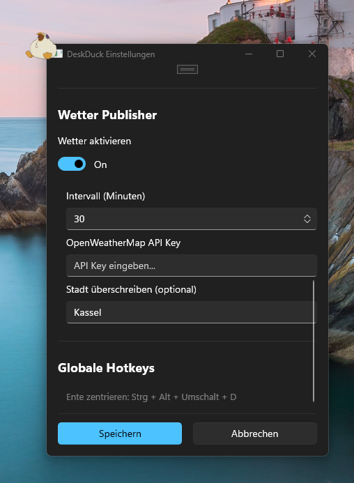

# 🦆 DeskDuck

> DeskDuck is a high-performance, transparent desktop companion for Windows 10/11 that combines system observability with a local AI assistant.

[](https://dotnet.microsoft.com/)
[](https://learn.microsoft.com/windows/apps/windows-app-sdk/)
[](https://www.rabbitmq.com/)
[](https://opensource.org/licenses/Apache-2.0)

<div align="center">
  
</div>

---

## Table of Contents

- [Features](#features)
- [Architecture & Design](#architecture--design)
- [Getting Started](#getting-started)
- [Configuration & Secrets](#configuration--secrets)
- [Testing](#testing)
- [Troubleshooting](#troubleshooting)
- [Project Structure](#project-structure)
- [License](#license)

---

## Features

- **🦆 Animated Mascot**: A click-through, transparent duck that walks around your desktop. You can drag and drop it anywhere, and it changes animations dynamically.
- **🤖 Local AI Chat**: Right-click the duck to open a chat window. It uses a local Ollama model so your conversations remain 100% private and never leave your machine.
- **📊 System Monitoring**: The duck acts as a health-check for your PC, warning you via speech bubbles if your CPU, RAM, or Battery hit critical levels.
- **🌤️ Live Weather**: Fetches real-time weather data for your location and displays it as a notification on the duck.
- **⌨️ Global Hotkey**: Lost the duck on a multi-monitor setup? Press `Ctrl + Alt + Shift + D` to instantly teleport it back to the center of your screen.
- **⚙️ Customization**: A built-in Settings window allows you to toggle modules, set warning thresholds, and adjust the duck's movement speed.

---

## Architecture & Design

```text
┌──────────────────────────────────────────────────────────────┐
│                        DeskDuck.exe                          │
│                                                              │
│  ┌────────────────┐   ┌────────────────┐   ┌──────────────┐  │
│  │   MainWindow   │   │   ChatWindow   │   │ Settings UI  │  │
│  │   (Overlay)    │<->│   (AI Chat)    │   │              │  │
│  └───────▲────────┘   └───────▲────────┘   └──────────────┘  │
│          │                    │                              │
│          │                    ▼                              │
│  ┌───────┴────────┐   ┌────────────────┐                     │
│  │ RabbitMQ       │   │ Ollama Client  │◄──► Local Ollama    │
│  │ Consumer       │   └────────────────┘                     │
│  └───────▲────────┘                                          │
│          │                                                   │
│          │    ┌───────────────────────────────────────────┐  │
│          │    │ Background Publishers (Monitor, Weather)  │  │
│          │    └──────────────────┬────────────────────────┘  │
└──────────┼───────────────────────┼───────────────────────────┘
           │                       │
      [Consumes]              [Publishes]
           │                       │
           │                       ▼
   ┌───────┴───────────────────────┴────────┐
   │             RabbitMQ Broker            │ (Docker Container)
   └────────────────────────────────────────┘
```

### Key Architectural Decisions
- **Vertical Slice Architecture**: Features like Chat, SystemMonitor, and Settings are grouped into independent slices. This maximizes cohesion and allows enabling/disabling features easily.
- **Decoupled Messaging (RabbitMQ)**: Background services (Publishers) and the UI (Consumer) run in the same process but communicate solely via AMQP. This guarantees UI responsiveness and ensures notifications are queued and displayed sequentially.
- **Local-First AI**: By utilizing Ollama directly on the host machine, the app guarantees zero-latency, offline-capable, and private LLM interactions without API costs.

---

## Tech Stack

| Layer | Technology |
|---|---|
| UI Framework | [WinUI 3 / Windows App SDK](https://learn.microsoft.com/windows/apps/windows-app-sdk/) |
| Language | C# 12 / .NET 10 |
| Message Broker | [RabbitMQ](https://www.rabbitmq.com/) via Docker |
| AMQP Client | [RabbitMQ.Client](https://www.nuget.org/packages/RabbitMQ.Client) |
| AI Backend | [Ollama](https://ollama.com/) (local LLM inference) |
| Ollama Client | [OllamaSharp](https://github.com/awaescher/OllamaSharp) |
| Weather API | [OpenWeatherMap](https://openweathermap.org/api) |
| Geolocation | [ip-api.com](http://ip-api.com) |
| Dependency Injection | `Microsoft.Extensions.Hosting` / `Microsoft.Extensions.DependencyInjection` |
| Configuration | `Microsoft.Extensions.Configuration` (JSON, hot-reload) |
| Win32 Interop | P/Invoke (`user32.dll`, `kernel32.dll`, `comctl32.dll`) |
| Serialization | `System.Text.Json` (source-generated, AOT-safe) |
| Containerisation | Docker Compose |
| Testing | xUnit, Moq, coverlet |

---

## Getting Started

### Prerequisites

| Requirement | Notes |
|---|---|
| Windows 10 (1809+) or Windows 11 | Required by WinUI 3 |
| [.NET 10 SDK](https://dotnet.microsoft.com/download/dotnet/10.0) | Build toolchain |
| [Docker Desktop](https://www.docker.com/products/docker-desktop/) | Runs RabbitMQ |
| [Ollama](https://ollama.com/) | Optional — only needed for AI chat |

### Quick Start

Run these commands in your terminal to get the duck up and running:

```bash
# 1. Clone the repository
git clone https://github.com/yourusername/DeskDuck.git
cd DeskDuck

# 2. Start the local RabbitMQ broker
cd DockerDuck
docker compose up -d
cd ..

# 3. Pull an Ollama model (optional, for AI chat)
ollama pull llama3.2

# 4. Build and launch the app
dotnet run --project DeskDuck/DeskDuck.csproj
```

> **Note:** The app targets `net10.0-windows10.0.19041.0` and requires the Windows App SDK runtime. The RabbitMQ management UI is available at [http://localhost:15672](http://localhost:15672) (user: `deskduck`, password: `deskduck`).

---

## Configuration & Secrets

Settings are stored and merged from two locations:
1. `DeskDuck/appsettings.json` (Default configuration shipped with the app)
2. `%LocalAppData%\DeskDuck\appsettings.json` (User configuration, edited via the UI)

### Core Parameters

| Category | Parameter | Type | Default | Description |
|---|---|---|---|---|
| **RabbitMQ** | `HostName` | string | `localhost` | **[Required]** Hostname of the RabbitMQ broker. |
| **RabbitMQ** | `UserName` | string | `deskduck` | **[Required]** Authentication user. |
| **RabbitMQ** | `Password` | string | `deskduck` | **[Required]** Authentication password (see Secrets below). |
| **Duck** | `Speed` | double | `1.5` | Movement speed of the duck across the screen (pixels per tick). |
| **Ollama** | `Model` | string | `llama3.2:latest` | Local LLM model name to use for AI chat. |
| **Publishers** | `Weather:ApiKey` | string | `""` | **[Required]** OpenWeatherMap API key. |

### Secrets Management (Local Development)

To avoid checking passwords and API keys into source control, use `.NET User Secrets` during local development:

```bash
cd DeskDuck
dotnet user-secrets init
dotnet user-secrets set "RabbitMQ:Password" "my_super_secret"
dotnet user-secrets set "Publishers:Weather:ApiKey" "your_owm_api_key"
```

---

## Testing

The project uses `xUnit` and `Moq` for unit testing, focusing on the core business logic (e.g. State Machines, AI Chat Service, Movement Logic).

To run the test suite:
```bash
dotnet test DeskDuck.slnx
```

---

## Troubleshooting

- **RabbitMQ Port Conflict (`Port 5672 already in use`)**: 
  Make sure you don't have a local Erlang/RabbitMQ service running directly on Windows. Stop the local service or change the port mapping in `DockerDuck/docker-compose.yml`.
- **Weather Notifications aren't appearing**: 
  Ensure you have added a valid API key via user-secrets (`Publishers:Weather:ApiKey`).
- **AI Chat doesn't answer**: 
  Ensure Ollama is running in the background (`ollama serve`) and that the specified model (`llama3.2`) has been pulled (`ollama pull llama3.2`).

---

## Project Structure

DeskDuck uses a **Vertical Slice Architecture** to group all related files (Views, ViewModels, Services, and Models) by feature rather than by technical layer. This maximizes cohesion, minimizes coupling, and makes adding or removing features significantly easier.

```text
DeskDuck/
├── DeskDuck/              # WinUI 3 App (Views, XAML, Window lifecycle)
│   ├── Features/          # UI-specific feature slices (ChatWindow, SettingsWindow)
│   ├── Assets/            # GIFs, Icons, Images
│   └── App.xaml           # Application entry point
│
├── DeskDuck.Core/         # Business logic (No WinUI dependencies)
│   ├── Features/          # Core feature slices
│   │   ├── Chat/          # Ollama integration, ChatMessage models
│   │   ├── Messaging/     # RabbitMQ publisher & background consumer
│   │   ├── Settings/      # I/O logic for appsettings.json
│   │   ├── Shell/         # MainViewModel (IMessenger bindings)
│   │   ├── SystemMonitor/ # Metrics publisher (CPU, RAM, Battery)
│   │   └── Weather/       # OpenWeatherMap publisher and options
│   ├── Manager/           # DuckMovementManager & DuckStateMachine
│   └── Core/              # ServiceCollection DI registrations
│
├── DeskDuck.Tests/        # Unit Tests (xUnit, Moq)
│   └── Features/          # Mirrors DeskDuck.Core structure
│
└── DockerDuck/
    └── docker-compose.yml # RabbitMQ service definition
```

---

## Screenshots

### 🦆 Duck Walking on the Desktop


---

### 🔔 Notification Bubble



---

### 🤖 AI Chat Window



---

### ⚙️ Settings Window







---

## License

This project is provided for portfolio and demonstration purposes.
